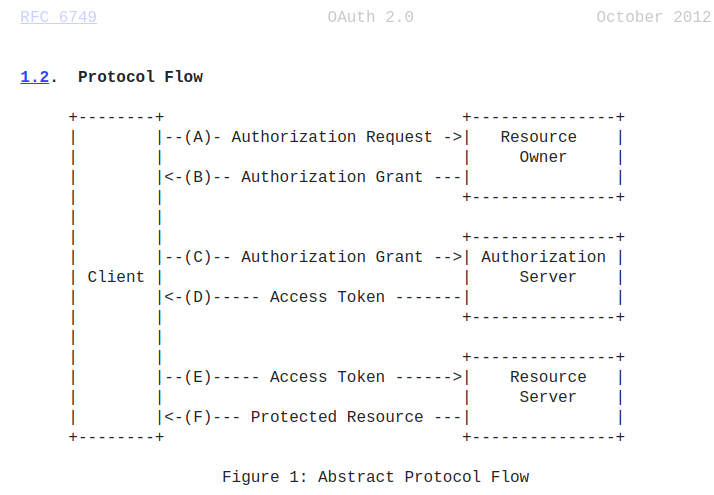

# Authentication and KeyCloak

## Introduction to OAuth 2 and OpenID Connect

[<- Index](../../README.md)

 

### Overview

https://plataforma.fullcycle.com.br/courses/242/168/108/conteudos?capitulo=108&conteudo=6308

- SSO (Single Sign On);
- Authorization and access delegation;
- Authentication;
- OAuth2 and OpenID Connect;
- All microservices will use these;
- KeyCloak (https://github.com/keycloak/keycloak);
  - Create different rules for different clients;
  - Centralize users;

### Basic Concepts about OAuth

https://plataforma.fullcycle.com.br/courses/242/168/108/conteudos?capitulo=108&conteudo=6307

- Elements of an **authorization** process:

  - **Resource Owner**: An entity (usually a user) that has the ability to grant access to a protected resource (e.g., their personal information).
  - **Resource Server**: A server hosting the protected resources and responsible for accepting and responding to requests for these resources, using access tokens.
  - **Client**: An application or service that requests access to protected resources on behalf of the resource owner, after obtaining authorization.
  - **Authorization Server**: A server responsible for authenticating the resource owner, issuing access tokens to the client, and managing the authorization process.

- Analogy

  - [Resource Owner] John has a bank account;
  - [Resource Server] David is the bank manager of John's account;
  - [Client] Mary is John's wife;
  - [Authorization Server] The local Registry (Cartório) where John and Mary registered a letter of attorney (Procuração);

- Story

  - Mary [Client] presents a letter of attorney [Token] and asks David [Resource Server] to make a transaction in the name of John [Resource Owner];
  - David [Resource Server] calls the Registry [Authorization Server] to verify if the letter of attorney [Token] is valid;
  - Registry [Authorization Server] confirms that the letter [Token] is valid;
  - David [Resource Server] then allows Mary [Client] to make the transaction in the name of John [Resource Owner];

- OAuth 2.0

  - "The OAuth 2.0 authorization framework enables a third party application to obtain **limited** access to an HTTP service" (https://tools.ietf.org/html/rfc6749).

  - It is an **authorization** framework, not an **authentication** framework;

   
  

    
    
Source: (“RFC ft-ietf-oauth-v2: The OAuth 2.0 Authorization Framework,” 2012)

  

   

### OpenID Connect

https://plataforma.fullcycle.com.br/courses/242/168/108/conteudos?capitulo=108&conteudo=6306

- OpenID Connect 1.0 is a simple identity layer on top of the OAuth 2.0 [RFC6749] protocol. It enables Clients to verify the identity of the End-User based on the authentication performed by an Authorization Server, as well as to obtain basic profile information about the End-User in an interoperable and REST-like manner (“Final: OpenID Connect Core 1.0 incorporating errata set 1,” n.d.);

- OpenID Connect Flow

 

  
  
Source: (Wagde, 2022)

 

- Flows

  - OAuth 2.0 Authorization Framework, as defined in RFC 6749, has an API definition named "authorization endpoint";
  - This API receives the parameter "response_type";
  - OpenID Connect uses this parameter to emit the authentication token;
  - When we use only OAuth 2.0, this parameter can be "code" or "token";
  - When using OpenId Connect, a new valuea can be added: "id_token";
  - Together with "id_token" the "openid" value can be passed as part of the scope in the OAuth 2.0 flow;

- Possible variations for "response_type"

  - "response_type" is the key information to set the workflow;
  - possible combination options:
    - code
    - token
    - id_token
    - id_token token
    - code id_token
    - code token
    - code token id_token
    - none

- What is "id_token"?

  - Carries information needed to grant user authentication such as id, email and other additional information sent by authentication server;
  - JWT (JSON Web Tokens);
    - Open standard that represents securely information requests between parts;
    - Token is a base64 that stores a JSON content;
    - JWT needs 3 parts:
      - Header;
      - Payload;
      - Signature;

## Getting Started with KeyCloak

### Getting Started Docker tutorial

https://plataforma.fullcycle.com.br/courses/242/168/108/conteudos?capitulo=108&conteudo=6432

- Follow steps described in keycloak getting started page: https://www.keycloak.org/getting-started/getting-started-docker

### Creating our first client

- (KeyCloak) Update the "myclient" created in the last class;

  - (KeyCloak) Set "Client Authentication" to "On" (http://localhost:8080/admin/master/console/#/myrealm/clients/1938d40f-103c-4555-980b-ccea1d1ef420/settings);
  - (KeyCloak) Access "Credentials" tab (http://localhost:8080/admin/master/console/#/myrealm/clients/1938d40f-103c-4555-980b-ccea1d1ef420/credentials)
  - (KeyCloak) Copy the client secret;

- (Go) Create a client service in go;
  - (Go) Implementation is described [here](./keycloak-go/goclient/main.go)

# References

- RFC ft-ietf-oauth-v2: The OAuth 2.0 Authorization Framework. (2012, October 13). IETF Datatracker. Retrieved Retrieved May 1, 2023, from https://datatracker.ietf.org/doc/html/rfc6749
- Final: OpenID Connect Core 1.0 incorporating errata set 1. (n.d.). Final: OpenID Connect Core 1.0 Incorporating Errata Set 1. Retrieved Retrieved May 1, 2023, from https://openid.net/specs/openid-connect-core-1_0.html#Introduction
- Wagde, S. (2022, November 15). OAuth 2.0 Resource Server With Spring Security 5, Baeldung. Retrieved May 1, 2023, from https://www.baeldung.com/spring-security-oauth-resource-server
- Team, K. (2023). Docker - KeyCloak, Docker - KeyCloak. Retrieved May 1, 2023, from https://www.keycloak.org/getting-started/getting-started-docker

 

---

- Citation Format: Journal of Information Technology
- Tool used for generating citations: https://quillbot.com/
